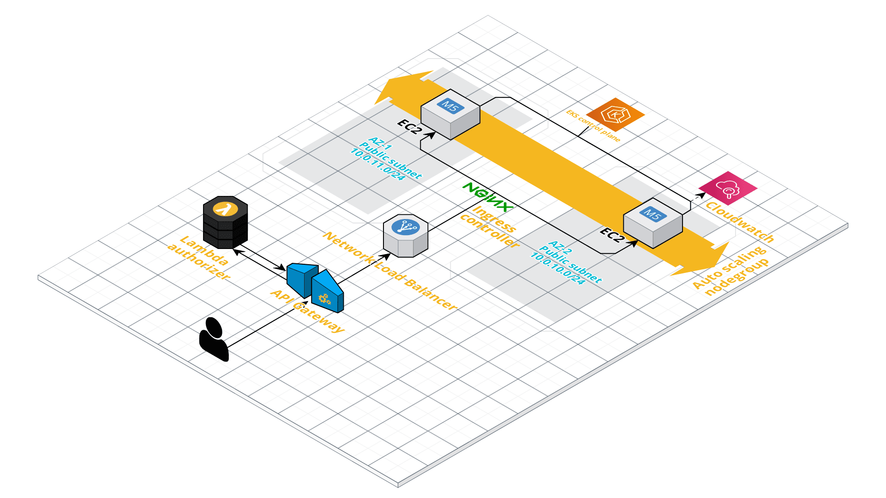

# eks-with-terraform

## Proposed solution for below use case

A company called ‘Max Weather’ wants to build a platform that forecasts the weather. They decided to build that application on AWS cloud infrastructure, and they also want to leverage certain capabilities.

## Architecture diagram 



> This diagram aims to show all the infrastructure components required to deploy this application with logical connections between components. 

EKS worker nodes are spun up across two subnets for high availability and to avoid single point of failure. The cluster size can be dynamically adjusted in response to high traffic by the use of `cluster autoscaler`. Further, `hpa` or horizontal pod autoscaler can scale up or down the kubernetes pods to match demand. 

For monitoring and troubleshooting, fluentd agent is set up as a daemonset on the cluster so that the control plane, worker node and application logs are captured and sent to cloudwatch.

`nginx-ingress-controller` is used to manage external access to services in the cluster. It is exposed via a Network Load Balancer (NLB).

In order to expose functionality as API and secure it with OAuth2 authorization, `AWS API Gateway` is used with a `lambda-based authorizer`.

All of the infra is created using terraform scripts except for AWS API Gateway. Apps such as cluster-autoscaler, metrics-server for use in hpa, fluentd, sample app for max weather etc. are created with k8s manifest files.

Terraform backend is stored in s3 bucket.

## How to create and destroy infra

```
# Run below command in root to create infra and deploy app
make create_all

# Run below command in root to delete app and destroy infra created by terraform
make delete_all
```

**Note**: Refer `makefile` for commands to create/destroy the items individually.

## Command to test working API with authorization

> Note: Replace actual gateway id in command 

```
curl -X GET \
  https://<gateway-id>.execute-api.us-east-1.amazonaws.com/model/predict \
  -H 'authorizationtoken: allow' \
  -H 'cache-control: no-cache'
```